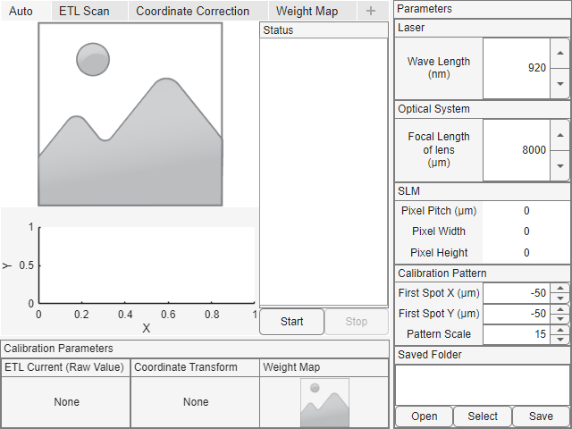
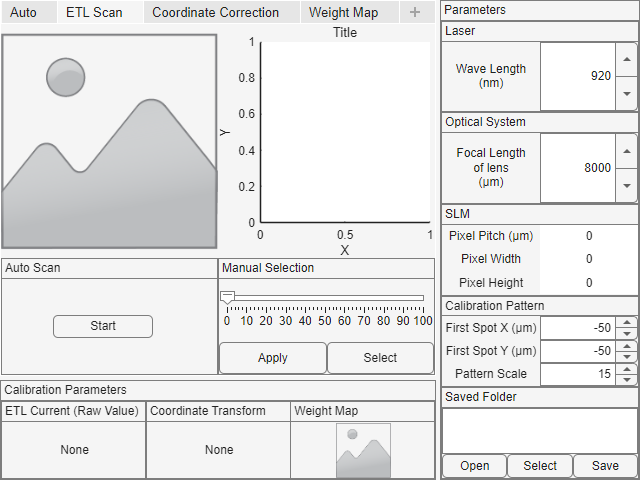
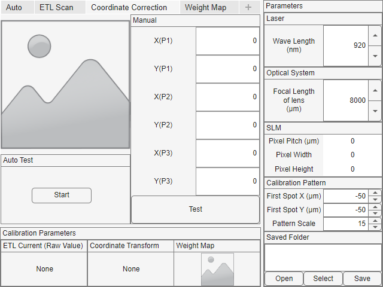

# 使用法

## 機器のセットアップ

使用機器の準備をします。

### カメラ

任意のカメラを用意します。

任意のカメラは`devices.camera.Camera`を実装している必要があります。

Andor製カメラ用のクラスは実装されています。
使用する際は環境にAndor製カメラ用のAPIがインストールされていることを確認してください。

```matlab
camera = devices.camera.andor.AndorCamera();
% 使用開始
camera.open();

% いくつかの公開メソッドがあります
camera.setExposureTime(0.25);
camera.setEMCCDGain(100);
% ...

% 撮影
image = camera.take();

% 終了時
camera.close();
```

#### 背景減算
カメラはいくつかラッパークラスが用意されています。
`devices.camera.BackgroundRemoveCameraWrapper` は撮影した画像を事前に撮影した背景光画像を用いて減ずる効果があります。
必要に応じて併用できます。
```matlab
andorcamera = devices.camera.andor.AndorCamera();
camera=devices.camera.BackgroundRemoveCameraWrapper(andorcamera);

camera.open();

% 背景光撮影
% レーザーなどは全てオフにしておいてください
camera.updateBackGround();

% 背景画像が減じられてコントラストの改善などが期待できます。
image = camera.take();
```

### SLM
任意のSLMを用意します。

任意のSLMは`devices.slm.PhaseSLM`を実装している必要があります。
SLMに提示する位相変調パターンは`devices.slm.PhaseMap`を使用すると簡単に作成できます。

Santec製SLM-200用のクラスは実装されています。

```matlab
% 引数でディスプレイを指定
slm = devices.slm.SantecSLM200DisplayHosted.createForDisplay(3);

% 使用開始
slm.open();

pixelPitch_um = slm.getPixelPitch();
[ySlmSize,xSlmSize] = slm.getPixelArraySize();

% 空の位相変調データ
phasemap = devices.slm.PhaseMap(xSlmSize,ySlmSizes,pixelPitch_um,pixelPitch_um, ...
    8000, ... % 集光レンズの焦点距離 8000μm の場合
    920 ... % 光の波長 920nm の場合
);

% 集光点の追加
phasemap.addSpot(x,y,z,power);
phasemap.addSpot(x,y,z); % power は省略できます。

phaseArray=phasemap.getPhaseArray();
slm.apply(phaseArray);

% 終了時
slm.close();
```

### ETL

任意のETLを用意します。

任意のETLは`devices.etl.ETL`を実装している必要があります。

Optotune製ETL用のクラスは実装されています。

```matlab
% 引数で接続先シリアルポートを指定
etl = devices.etl.OptotuneLensDriver("COM6");
% 使用開始
etl.open();

% 生の値で指定
etl.setCurrentRaw(1000);
% 一応 mA 単位の指定が可能
etl.setCurrent(0.12);

% 終了時
etl.close();
```

## GUIの使用

`tools.gui.AutoCalibrator`によってGUIが起動します。

```matlab
% 変数で抱えておくことをお勧めします
gui = tools.gui.AutoCalibrator
```



画面右側でレーザー波長などの設定ができます。

画面左下に補正結果が表示されます。

画面右下で設定や補正結果の保存と読み出しができます。  
- [*Open*]
  - フォルダをダイアログで選択して開きます
- [*Select*]
  - テキストボックス内のフォルダ名を用いてフォルダを開きます
- [*Save*]
  - テキストボックス内のフォルダ名を用いてフォルダに保存します

画面左上で補正をおこないます。

- [*Start*]
  - 自動補正を行います
- [*Stop*]
  - 何も止めることができない無意味な存在
  - だいたいこれのせい
  - そしてこれは全部あれのせい

上部のタブから任意のプロセスを独立に実行できます。

### ETL Scan



- [*Start*]
  - 自動補正を行います
- [*Manual Selection*]
  - 手動選択を行います
    - [*Apply*]
      - スライダで指定した値でカメラを撮影します
    - [*Select*]
      - スライダで指定した値で補正設定を完了します

### Coordinate Correction


- [*Start*]
  - 自動補正を行います
  - 最初に照射するパターンの位置と大きさは画面右の [*Calibration Pattern*] の項で変更できます
- [*Manual Selection*]
  - 手動補正を行います
    - [*(X|Y)\(P(1|2|3)\)*]
      - 照射する三点の座標を指定します
    - [*Test*]
      - 指定した座標でアフィン変換推定を試みます

### Weight Map
未実装

## 補正結果の取得

補正が完了したら以下のように結果を取得できます。

```matlab
gui = tools.gui.AutoCalibrator

% 補正作業完了

% 結果取得
[etlValue,positionCalibrator,intensityMap] = gui.getResult();
```

- `etlValue {mustBeNumeric}`
- `positionCalibrator calibration.PositionCalibrator`
- `intensityMap calibration.IntensityWeightMap`

未完の場合は空の値が返ります。

次のようにして結果を使用できます。
```matlab
% ETL 設定
etl.setCurrentRaw(etlValue);
```

```matlab
% 集光点の作成
% 集光点の配列 (各行に画像内のX,Yの順で指定)
positions = [ ...
    100,200; ...
    512,200; ...
    300,400 ...
]
% 現実の光学系における座標へ変換
opticalPos = positionCalibrator.calibratePointArray(positions);
phasemap = devices.slm.PhaseMap(xSlmSize,ySlmSizes,pixelPitch_um,pixelPitch_um, ...
    8000, ... % 集光レンズの焦点距離 8000μm の場合
    920 ... % 光の波長 920nm の場合
);
% 座標の指定
for i=1:3
    phasemap.addSpot(opticalPos(i,1),opticalPos(i,2),0);
    % 強度補正をする場合
    % 画像内の座標で指定すると補正係数が返ります
    power = intensityMap.getWeight(positions(i,1),positions(i,2));
    phasemap.addSpot(opticalPos(i,1),opticalPos(i,2),0,power);
end

slm.apply(phasemap.getPhaseArray);

image = camera.take();
```

面倒なら一連の操作を関数化してもよいです。